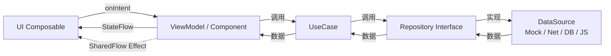

# ARCHITECTURE — xhunter 架构思想

> 📌 **快照截止步骤：2.2.b（Koin DI 完成）**  
> 📍 工程视图请配套阅读 [`MODULES.md`](./MODULES.md)；步骤节奏请配套阅读 [`ROADMAP.md`](./ROADMAP.md)。

xhunter 是一个 **学习驱动** 的 Kotlin Multiplatform 漫画阅读器项目，目标是一比一复刻 [venera-app/venera v1.6.3](https://github.com/venera-app/venera) 的功能集，覆盖 Android / iOS / Windows / macOS 四端。本文档只讲「思想层」——为什么这么分、各层心智模型；具体的工程目录与依赖图请看 [`MODULES.md`](./MODULES.md)。

## 一、整体架构定位

```
┌─────────────────────────────────────────────────┐
│  Platform Entry  (androidApp / iosApp / desktopApp) │
├─────────────────────────────────────────────────┤
│  composeApp    (CMP UI Shell + Decompose Root)      │
├─────────────────────────────────────────────────┤
│  feature-*     (Presentation: Screen + ViewModel)   │
├─────────────────────────────────────────────────┤
│  shared-domain (UseCase / Entity / Repo Interface)  │
├─────────────────────────────────────────────────┤
│  data-*        (Repository 实现 / DataSource 适配)   │
├─────────────────────────────────────────────────┤
│  core-*        (network / database / jsruntime / …) │
└─────────────────────────────────────────────────┘
```

**铁律**：上层依赖下层，下层绝不反向依赖。`feature` 之间不互相依赖，跨 feature 通信走 `shared-domain` UseCase 或导航参数。

> ⚠️ 这是 **目标蓝图**。当前快照截止 2.2.b 实际只有 `:androidApp` + `:shared` 两个 Gradle 模块——所有上述层级目前都压在 `shared` 里，按页面节奏陆续拆出。详见 [`MODULES.md` § 当前快照](./MODULES.md#当前快照截止-22b)。

## 二、KMP 心智模型

### 2.1 三套源集职责

| 源集 | 放什么 | 不放什么 |
| --- | --- | --- |
| `commonMain` | 跨平台业务逻辑、UI（Compose Multiplatform）、Domain、Repository、`expect class/fun` 声明 | 任何平台 API（Android Context / iOS UIKit / JVM File 等） |
| `androidMain` | `actual` 实现（用 Android API 兑现 expect）、Android 特有的 ViewModel 适配、Activity / Application | 业务逻辑（应放 commonMain） |
| `iosMain` | `actual` 实现（CInterop 调 ObjC/Swift API）、iOS 特定包装 | 业务逻辑 |
| `desktopMain` | `actual` 实现（JVM API）、桌面端窗口/菜单/系统托盘 | 业务逻辑 |

> 当前快照只用到 `commonMain` + `androidMain`；`iosMain` / `desktopMain` 在第 9 / 10 步引入。

### 2.2 expect / actual 使用纪律

- 优先用 **三方库的 KMP 实现**（Coil 3 / Ktor / SQLDelight / Koin / Decompose / Kermit）替代手写 expect/actual
- 仍需 expect 的场景：JS 引擎、文件选择器、下载调度（WorkManager vs BGTaskScheduler vs 协程常驻）
- expect 集中在 `core-*` 模块的固定 API 边界处暴露，feature 层不直接定义 expect

### 2.3 Compose Multiplatform 与 Jetpack Compose 的差异

- xhunter 的 UI 全部在 `commonMain` 用 **Compose Multiplatform** 写（API 与 Jetpack Compose 95% 重合）
- Material3 主题、`Modifier`、`LazyColumn`、`HorizontalPager` 等心智完全一致
- 不同点：图片加载用 Coil 3 KMP（不是 `coil-compose`），资源用 `compose-resources` 而非 R 文件
- Preview：跨模块 Composable 的 `@Preview` 必须放在 `androidMain` 用私有假实现承接（参考 `MainScreenPreview.kt`）

## 三、MVI 数据流

xhunter 选 MVI（Model-View-Intent）作为 UI 状态管理范式，与 Clean Architecture 配合。



### 3.1 三个核心抽象

| 抽象 | 用途 | 例子 |
| --- | --- | --- |
| **Intent** | 用户行为 / 系统事件，单向输入 | `LoadComics`、`SelectTab(home)`、`ToggleFavorite(id)` |
| **State** | UI 当前完整状态（**唯一可信源**） | `data class ExploreState(loading, list, error)` |
| **Effect** | 一次性副作用（不属于 State） | `NavigateToDetail(id)`、`ShowToast(msg)` |

### 3.2 ViewModel 还是 Component？

- 主页框架 / 跨页面导航 → **Decompose Component**（承担 ViewModel + 路由双重职责）
- 单页面内部状态 → **MviViewModel 基类**（在 `shared-domain` 抽象，第 2.2 步后引入）

> Decompose Component 用 `Value<T>` 暴露状态（语义同 `StateFlow`，但 Decompose 原生），Compose 侧用 `subscribeAsState()` 桥接。

### 3.3 何时用 SharedFlow Effect？

只用于「不该回放、不属于 UI 状态」的副作用：导航、Toast、Snackbar、震动、剪贴板写入。**不要**把 loading / error / data 放 Effect。

## 四、Clean Architecture 分层

```
Presentation (feature-*)         ← 知道 Compose / Decompose
        ↓ 依赖
Domain (shared-domain)            ← 纯 Kotlin，零外部依赖
        ↑ 实现 Repository 接口
Data (data-*)                     ← 知道 Repository 接口
        ↓ 依赖
Core (core-*)                     ← 知道平台技术（Ktor / SQLDelight / JS 引擎）
```

### 4.1 各层只暴露什么

| 层 | 输出（公共 API） | 隐藏（实现细节） |
| --- | --- | --- |
| Presentation | Composable Screen + Component/ViewModel | UI 内部状态、Compose recomposition 细节 |
| Domain | Entity / Repository 接口 / UseCase | — |
| Data | Repository 实现（仅注册到 DI） | DataSource、DTO、网络/DB schema |
| Core | expect API（如 `JsRuntime`、`HttpClient`、`SqlDriver`） | 平台 actual 细节 |

### 4.2 数据模型分三层

- **DTO**（Data 层内部）：直接对应 JSON / SQL 行 / JS 返回值，可变 / 容错
- **Entity**（Domain 层）：业务模型，不可变 data class，有完整不变量
- **UI Model**（Presentation 层，按需）：仅 UI 用的派生字段（如格式化后的日期字符串）

### 4.3 错误处理

- Data 层捕获平台异常 → 转成 Domain 自定义 `Result<T, ComicError>` / `sealed class ComicError`
- Domain 层 UseCase 不抛异常，统一返回 Result
- Presentation 层 ViewModel 把 `Result.failure` 翻译成 `State.error` 或 `Effect.ShowToast`

## 五、关键技术决策（决策卡）

每个决策只列结论 + 一行理由。完整对比详见 plan「关键技术决策」章节。

### 决策 D1 · 导航：Decompose（不是 Voyager）

- **结论**：用 Decompose 3.x 做 Component + ChildStack 路由
- **理由**：Component 模型契合 Clean 分层（VM + Navigation 合体）、桌面端窗口栈/深链支持完善、与 Compose 解耦可纯 JVM 单测 Component
- **当前应用**：第 2.2.a 步引入 `RootComponent` 承担 4 Tab 选中状态

### 决策 D2 · DI：Koin（不是 Hilt）

- **结论**：用 Koin 4.x 做依赖注入
- **理由**：Hilt 不支持 KMP；Koin 4.x 一等公民支持 commonMain + 各平台启动 API
- **当前应用**：第 2.2.b 步引入 `sharedModule` 注册 `RootComponent`，`XHunterApplication` 启动 Koin
- **使用纪律**：模块定义放 `shared/commonMain`，平台 actual 注册放 `<platform>Main`，启动 Koin 放各 App 入口

### 决策 D3 · 数据库：SQLDelight（不是 Room KMP）

- **结论**：用 SQLDelight 2.x 做关系存储
- **理由**：Room KMP 对 Desktop 仍不稳定；SQLDelight 编译期 SQL 校验 + 多端 Driver（Android / Native / JVM）成熟
- **引入时机**：第 6.3 步收藏页持久化

### 决策 D4 · 图片加载：Coil 3（不是 Kamel）

- **结论**：用 Coil 3 KMP
- **理由**：官方支持 KMP + 与 Android 心智一致 + 双层缓存
- **引入时机**：第 3.3 步首页封面

### 决策 D5 · JS 引擎：分平台不强求统一

- **结论**：Android 用 Zipline 或 QuickJS-Android、iOS 用 JavaScriptCore（CInterop）、Desktop 用 GraalJS 或 Javet
- **理由**：venera 协议核心是 ECMAScript，任何符合 ES 规范的引擎都能跑；统一引擎反而牺牲端原生体验
- **抽象方式**：`expect class JsRuntime` 在 `core-jsruntime` 暴露统一 API
- **引入时机**：第 8.1 / 9.2 / 10.2 步分别落地

### 决策 D6 · 网络：Ktor Client（不是 OkHttp 直连）

- **结论**：Ktor Client + 各端 Engine（Android: OkHttp / iOS: Darwin / JVM: CIO）
- **理由**：KMP 一等公民、协程友好、可插拔 Engine 解耦平台
- **引入时机**：第 8 步接入真实源时

## 六、性能与可靠性约束

- **图片**：Coil 3 双层缓存（内存 + 磁盘）+ 阅读器邻接 3 页预加载
- **阅读器手势**：用 `Modifier.graphicsLayer{}` + `derivedStateOf`，避免每帧 recomposition
- **JS 调用**：`Dispatchers.IO` + 单线程 confined（QuickJS 非线程安全）；同 query 30s 缓存防抖
- **下载器**：Android WorkManager / iOS BGTaskScheduler / Desktop 常驻协程，统一 `expect class DownloadScheduler`
- **日志**：Tag 用模块前缀（`[JsRuntime]`、`[Reader]`）；网络日志只记 URL + 状态码不记响应体；Kermit 多端统一

## 七、扩展点 / Hook 思路

| 扩展场景 | 接入位置 |
| --- | --- |
| 新增漫画源（JS 插件） | `data-source-plugin` 加载 JS 文件，无需改 `data-comic` |
| 替换 JS 引擎 | 各端 `core-jsruntime` actual 单独换，commonMain 不动 |
| 新增 feature 页面 | `feature-xxx` 模块 + 注册到 `RootComponent.ChildStack` |
| 新增持久化字段 | `core-database` 改 `.sq` schema + 升级 SQLDelight migration |

## 八、何时回看本文档？

- 新建任何 Gradle 模块前 → 看「Clean Architecture 分层」决定放哪一层
- 写 expect/actual 前 → 看「KMP 心智模型」决定该不该写 expect
- 在 ViewModel 里要发副作用前 → 看「MVI 数据流」决定走 State 还是 Effect
- 选型新库前 → 看「关键技术决策」是否已有同类决策可复用

---

> **维护约定**：每次拆出新模块或新增决策，作为对应步骤阶段 E 的归档动作之一更新本文档，并把"快照截止步骤"前移。详见 [`MODULES.md` § 新增模块 Checklist](./MODULES.md#新增模块-checklist)。
