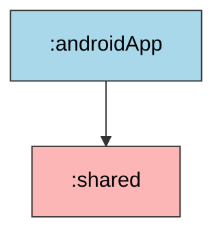
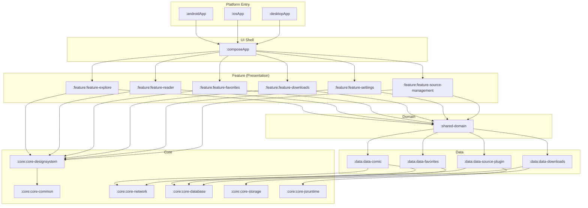

# MODULES — xhunter 工程模块视图

> 📌 **快照截止步骤：2.2.b（Koin DI 完成）**  
> 📍 思想层请配套阅读 [`ARCHITECTURE.md`](./ARCHITECTURE.md)；步骤节奏请配套阅读 [`ROADMAP.md`](./ROADMAP.md)。

本文档分三视角呈现 xhunter 的 Gradle 工程结构：**当前快照**（真实代码状态）、**目标蓝图**（plan 全模块图）、**演进路线**（步骤号 → 引入的模块）。

---

## 当前快照（截止 2.2.b）

### 模块清单

`settings.gradle.kts`：

```kotlin
include(":androidApp")
include(":shared")
```

只有 **2 个 Gradle 模块**。所有 Domain / Data / Core 概念目前都内嵌在 `shared/commonMain` 的子包里，按页面节奏逐步拆出（详见下文「演进路线」）。

### 当前依赖图



### 模块卡片

#### `:shared`（KMP 库 + Compose Multiplatform）

| 字段 | 内容 |
| --- | --- |
| 类型 | Kotlin Multiplatform Library + Android Library + Compose Multiplatform |
| Namespace | `com.lwtor.xhunter.shared` |
| 源集 | `commonMain` / `androidMain` / `commonTest` / `androidHostTest` |
| 关键依赖 | compose（runtime / foundation / material3 / ui / resources） · material-icons-core · lifecycle-viewmodel-compose · decompose · decompose-extensions-compose · koin-core |
| 关键文件 | `commonMain/.../App.kt` · `commonMain/.../GreetingUtil.kt` · `commonMain/.../ui/main/MainTab.kt` · `commonMain/.../ui/main/MainScreen.kt` · `commonMain/.../ui/main/RootComponent.kt` · `commonMain/.../di/SharedModule.kt` · `androidMain/.../ui/main/MainScreenPreview.kt` |
| 当前职责 | 内嵌 UI 层（main 包）+ DI 模块定义（di 包），后续会拆出 Domain / Data / Core / feature-* |
| 引入步骤 | 第 1 步（KMP 向导生成） |

#### `:androidApp`（Android Application）

| 字段 | 内容 |
| --- | --- |
| 类型 | Android Application |
| ApplicationId / Namespace | `com.lwtor.xhunter` |
| 关键依赖 | `:shared` · activity-compose · decompose · koin-android |
| 关键文件 | `MainActivity.kt` · `XHunterApplication.kt` · `AndroidManifest.xml` |
| 当前职责 | Android 端入口：启动 Koin、构造 `defaultComponentContext()`、注入 `RootComponent`、`setContent { App(rootComponent) }` |
| 引入步骤 | 第 1 步（KMP 向导生成） |

### 当前包结构（`:shared` commonMain）

```
com.lwtor.xhunter
├── App.kt                     # 入口 Composable，MaterialTheme + MainScreen
├── GreetingUtil.kt            # 第 1 步遗留的 expect/actual 演示
├── di/
│   └── SharedModule.kt        # Koin module，注册 RootComponent
└── ui/
    └── main/
        ├── MainTab.kt          # 4 Tab enum
        ├── MainScreen.kt       # Scaffold + NavigationBar
        └── RootComponent.kt    # Decompose Root 接口 + 默认实现
```

> 上述包将随后续步骤逐步迁移到独立模块（详见演进路线）。

---

## 目标蓝图（步骤总览完成态）

### 完整模块依赖图



> 模块边界对应 [`ARCHITECTURE.md` § 整体架构定位](./ARCHITECTURE.md#一整体架构定位) 的分层。

### 目标模块卡片简表

| 模块 | 层 | 职责一句话 | 引入步骤 |
| --- | --- | --- | --- |
| `:composeApp` | UI Shell | CMP 入口 + Decompose Root，承载 ChildStack | 第 2.x 步从 `:shared` 拆出（具体步骤见演进路线） |
| `:androidApp` | Platform Entry | Android 入口（已存在） | 第 1 步 ✅ |
| `:iosApp` | Platform Entry | iOS 入口 | 第 9.1 步 |
| `:desktopApp` | Platform Entry | Desktop 入口 | 第 10.1 步 |
| `:feature:feature-explore` | Feature | 首页 + 详情页 | 第 3.1 步 |
| `:feature:feature-reader` | Feature | 阅读器 [AI 兜底] | 第 5.1 步 |
| `:feature:feature-favorites` | Feature | 收藏页 | 第 6.1 步 |
| `:feature:feature-downloads` | Feature | 下载页 | 第 7.1 步 |
| `:feature:feature-settings` | Feature | 设置页 + 我的 | 第 7.1 步 |
| `:feature:feature-source-management` | Feature | 漫画源管理页 | 第 8.2 步 |
| `:shared-domain` | Domain | UseCase + Entity + Repo 接口 + MVI 基类 | 第 2.2 步开始引入（MVI 基类） |
| `:data:data-comic` | Data | ComicRepository（先 Mock 后真实） | 第 3.3 步（Mock）→ 第 8.3 步（真实） |
| `:data:data-source-plugin` | Data | JS 漫画源加载与协议解析 [AI 兜底] | 第 8.2 步 |
| `:data:data-favorites` | Data | 收藏 Repository + DAO | 第 6.3 步 |
| `:data:data-downloads` | Data | 下载任务调度 + 持久化 | 第 7.1 步骨架 → 第 8.4 步真实 |
| `:core:core-common` | Core | Logger（Kermit）+ MVI 基类 + 通用工具 | 第 1 步起内嵌 → 拆出步骤 TBD |
| `:core:core-designsystem` | Core | 主题、颜色、Typography、共享组件（ComicCard 等） | 第 2.1 步起内嵌 → 第 3.1 步可考虑拆出 |
| `:core:core-network` | Core | Ktor Client 配置 + 各端 Engine actual | 第 8 步 |
| `:core:core-database` | Core | SQLDelight Driver expect/actual | 第 6.3 步 |
| `:core:core-storage` | Core | multiplatform-settings + 文件系统（Okio） | 第 7.2 步 |
| `:core:core-jsruntime` | Core | JsRuntime expect class + 各端 actual [AI 兜底] | 第 8.1 步 |

---

## 演进路线（按步骤号回填）

下表列出从当前快照到目标蓝图，每一步会引入或拆出哪个模块。完成后该行打 ✅，并同步更新本文档「当前快照」章节。

| 步骤 | 动作 | 涉及模块 |
| --- | --- | --- |
| 1 | 项目初建（KMP 向导） | ✅ `:androidApp` + `:shared` |
| 2.1 | 底部 4 Tab UI（先内嵌 shared） | 暂不拆模块 |
| 2.2.a | Decompose 路由（先内嵌 shared） | 暂不拆模块 |
| 2.2.b | Koin DI（先内嵌 shared） | 暂不拆模块 |
| 2.3 | **本步：架构文档回填** | 不动模块，只补 docs |
| 3.1 | 首页 UI 骨架 | ➕ `:feature:feature-explore`（首次出现 feature 层） · ➕ `:core:core-designsystem`（可选首次拆出） |
| 3.2 | 首页 ViewModel + MVI | ➕ `:shared-domain`（首次出现 Domain 层，含 MVI 基类） |
| 3.3 | Mock 数据 + Coil | ➕ `:data:data-comic`（首次出现 Data 层） |
| 4.x | 详情页 | 复用 `:feature:feature-explore`（详情子组件） |
| 5.x | 阅读器 [AI 兜底] | ➕ `:feature:feature-reader` |
| 6.1 / 6.2 | 收藏页 UI / VM | ➕ `:feature:feature-favorites` |
| 6.3 | 收藏页持久化 | ➕ `:data:data-favorites` · ➕ `:core:core-database` |
| 7.1 | 下载/设置/我的 UI | ➕ `:feature:feature-downloads` · ➕ `:feature:feature-settings` · ➕ `:data:data-downloads`（骨架） |
| 7.2 | 三页 VM + 持久化 | ➕ `:core:core-storage` |
| 7.3 | 本地漫画导入 | 复用 `:data:data-comic` + `:core:core-storage` |
| 8.1 | JS 引擎抽象 [AI 兜底] | ➕ `:core:core-jsruntime` |
| 8.2 | JS 源协议解析 [AI 兜底] | ➕ `:data:data-source-plugin` · ➕ `:feature:feature-source-management` |
| 8.3 | 替换 Mock | 改 `:data:data-comic` 实现，feature 层不动 |
| 8.4 | 下载器接入真实源 [AI 兜底] | 完善 `:data:data-downloads` |
| 9.1 | iOS 入口 | ➕ `:iosApp` |
| 9.2 | iOS actual [AI 兜底] | 各 `:core:core-*` 模块加 `iosMain` actual |
| 10.1 | Desktop 入口 | ➕ `:desktopApp`（同时考虑拆出 `:composeApp`） |
| 10.2 | Desktop actual [AI 兜底] | 各 `:core:core-*` 模块加 `desktopMain` actual |
| 11.1 | Headless 模式 | ➕ `:composeApp` 子模块 headless 入口 |

> 每完成一行，作为该步骤阶段 E 归档动作之一更新本文档（修改"当前快照"章节 + 在演进路线对应行打 ✅ + 把顶部"快照截止步骤"前移）。

---

## 新增模块 Checklist

每次拆出新模块时按这 6 步走，确保 Gradle / 文档 / DI 都不漏：

1. **建子目录**
   - 路径：`feature/feature-xxx/` / `data/data-xxx/` / `core/core-xxx/`
   - 内含 `build.gradle.kts` + `src/commonMain/kotlin/com/lwtor/xhunter/<layer>/<feature>/`
2. **改 `settings.gradle.kts`**
   - 加 `include(":feature:feature-xxx")`
   - 项目访问路径用 `projects.feature.featureXxx`（已开启 `TYPESAFE_PROJECT_ACCESSORS`）
3. **配 `build.gradle.kts`**
   - 套用 `:shared` 的 plugins / sourceSets 模板
   - 仅暴露 namespace `com.lwtor.xhunter.<layer>.<feature>`
   - 按 [`ARCHITECTURE.md` § Clean Architecture 分层](./ARCHITECTURE.md#四clean-architecture-分层) 决定依赖方向
4. **加版本目录**（若引入新依赖）
   - 在 `gradle/libs.versions.toml` 同时新增 `[versions]` + `[libraries]` 别名
5. **回填本文件**
   - 「当前快照 § 模块卡片」加新模块卡片
   - 「演进路线」对应行打 ✅
   - 顶部「快照截止步骤」前移
6. **更新 ROADMAP / CHANGELOG / `04-summary.md`**
   - 走当前步骤的阶段 E 归档流程

---

## 维护约定

- 本文档是**工程视图**的唯一可信源；任何"模块依赖图"的疑问优先看这里
- 不与 [`ROADMAP.md`](./ROADMAP.md) 的步骤拆解重复（这里只列模块层面的引入时机）
- 不与 [`ARCHITECTURE.md`](./ARCHITECTURE.md) 的分层原则重复（这里只列具体模块）
